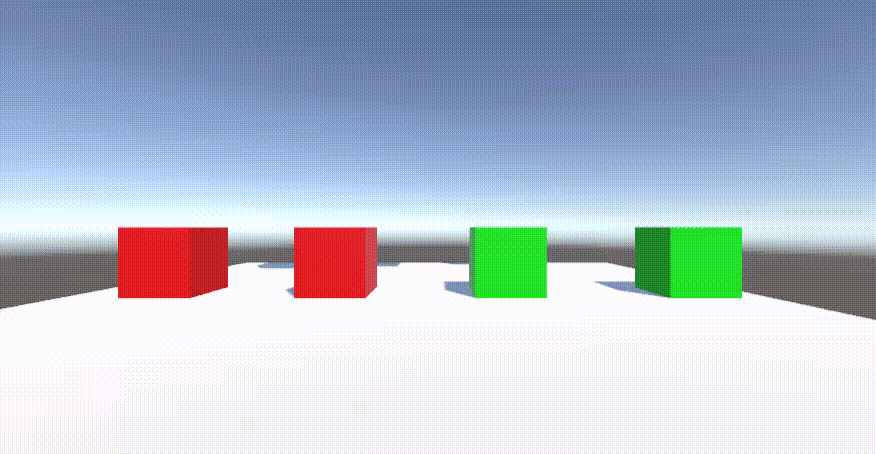

# АНАЛИЗ ДАННЫХ И ИСКУССТВЕННЫЙ ИНТЕЛЛЕКТ [in GameDev]
Отчет по лабораторной работе #4 выполнил:
- Плешивцев Денис Владимирович
- РИ-210948

Отметка о выполнении заданий (заполняется студентом):

| Задание | Выполнение | Баллы |
| ------ | ------ | ------ |
| Задание 1 | * | 60 |
| Задание 2 | * | 20 |
| Задание 3 | * | 20 |

знак "*" - задание выполнено; знак "#" - задание не выполнено;

Работу проверили:
- к.т.н., доцент Денисов Д.В.
- к.э.н., доцент Панов М.А.
- ст. преп., Фадеев В.О.

[](https://nodesource.com/products/nsolid)

[](https://travis-ci.org/joemccann/dillinger)

Структура отчета

- Данные о работе: название работы, фио, группа, выполненные задания.
- Цель работы.
- Задание 1.
- Код реализации выполнения задания. Визуализация результатов выполнения (если применимо).
- Задание 2.
- Код реализации выполнения задания. Визуализация результатов выполнения (если применимо).
- Задание 3.
- Код реализации выполнения задания. Визуализация результатов выполнения (если применимо).
- Выводы.
- ✨Magic ✨

## Цель работы
Познакомиться с перцептроном и реализовать его в проекте Unity.

## Задание 1
### В проекте Unity реализовать перцептрон, который умеет производить вычисления: OR, AND, NAND, XOR. Дать комментарии о корректности работы.

- Создал новый проект в Unity и к пустому Game Object подключил ```Perceptron.cs```:
 
```csharp

using System.Collections;
using System.Collections.Generic;
using UnityEngine;

[System.Serializable]
public class TrainingSet
{
	public double[] input;
	public double output;
}

public class Perceptron : MonoBehaviour {

	public TrainingSet[] ts;
	double[] weights = {0,0};
	double bias = 0;
	double totalError = 0;

	double DotProductBias(double[] v1, double[] v2) 
	{
		if (v1 == null || v2 == null)
			return -1;
	 
		if (v1.Length != v2.Length)
			return -1;
	 
		double d = 0;
		for (int x = 0; x < v1.Length; x++)
		{
			d += v1[x] * v2[x];
		}

		d += bias;
	 
		return d;
	}

	double CalcOutput(int i)
	{
		double dp = DotProductBias(weights,ts[i].input);
		if(dp > 0) return(1);
		return (0);
	}

	void InitialiseWeights()
	{
		for(int i = 0; i < weights.Length; i++)
		{
			weights[i] = Random.Range(-1.0f,1.0f);
		}
		bias = Random.Range(-1.0f,1.0f);
	}

	void UpdateWeights(int j)
	{
		double error = ts[j].output - CalcOutput(j);
		totalError += Mathf.Abs((float)error);
		for(int i = 0; i < weights.Length; i++)
		{			
			weights[i] = weights[i] + error*ts[j].input[i]; 
		}
		bias += error;
	}

	double CalcOutput(double i1, double i2)
	{
		double[] inp = new double[] {i1, i2};
		double dp = DotProductBias(weights,inp);
		if(dp > 0) return(1);
		return (0);
	}

	void Train(int epochs)
	{
		InitialiseWeights();
		
		for(int e = 0; e < epochs; e++)
		{
			totalError = 0;
			for(int t = 0; t < ts.Length; t++)
			{
				UpdateWeights(t);
				Debug.Log("W1: " + (weights[0]) + " W2: " + (weights[1]) + " B: " + bias);
			}
			Debug.Log("TOTAL ERROR: " + totalError);
		}
	}

	void Start () {
		Train(10);
		Debug.Log("Test 0 0: " + CalcOutput(0,0));
		Debug.Log("Test 0 1: " + CalcOutput(0,1));
		Debug.Log("Test 1 0: " + CalcOutput(1,0));
		Debug.Log("Test 1 1: " + CalcOutput(1,1));		
	}
	
	void Update () {
		
	}
}

```

### OR 

- Настроил _Input_ и _Output_ в соответствии с операцией __"ИЛИ"__ и запустил процесс обучения. Для достижения значения ___Total Error = 0___ понадобилось 4 эпохи обучения. Перцептрон научился безошибочно производить эту операцию:
  


- В среднем перцептрону требовалось около 4 эпох обучения. Только один раз перцептрону потребовалось всего 2 эпохи, чтобы полностью обучиться: 


### AND 

- Настроил _Input_ и _Output_ для операции __"И"__ и запустил обучение. В среднем для корректной работы перцептрону требовалось не менее 5-6 эпох обучения:
  


### NAND 

- Повторил действия для операции __"И-НЕ"__. В среднем для полного обучения требовалось 5 эпох:
  


### XOR 

- Аналогично настроил все для __"XOR"__ и запустил обучение. Видим, что 10 эпох для обучения перцептрона в этот раз не хватило. Значение  ___Total Error = 4___:
  


- Попробовал увеличить количество эпох ```Train(100000)```. Значение  ___Total Error___ по прежнему 4:


- Это связано с особенностью __"XOR"__. Если представить работу перцептрона на графике, получится примерно как на картинке ниже. Для предыдущих операций нам хватало одной _разделяющей прямой_. В случае _"исключающего или"_ необходимы две прямые, а соответственно два нейрона. Поэтому без дополнительного нейрона, сколько бы не было эпох обучения, перцептрон ___не будет работать корректно___.


## Задание 2
### Построить графики зависимости количества эпох от ошибки обучения. Указать от чего зависит необходимое количество эпох обучения.

- Для построения графиков я взял среднее значение ___Total Error___ для каждой эпохи из 3 успешных попыток обучения перцептрона:

- ### OR 


- ### AND 


- ### NAND 


- ### XOR 


- С каждой эпохой нейросеть переходит из ___недообученного___ состояния в ___оптимальное___. При этом, если вовремя не остановиться, она ___переобучится___ и утратит _обобщающую способность_. Поэтому необходимое количество эпох зависит от конкретной задачи и её сложности. Например, операции __"OR"__ перцептрон обучался довольно быстро, а для __"AND"__ и __"NAND"__ уже требовалось больше эпох.

## Задание 3
### Построить визуальную модель работы перцептрона на сцене Unity.

- Добавил ___OnTriggerEnter___ в ```Perceptron.cs```:

```csharp

void OnTriggerEnter(Collider other) {
	var input = this.gameObject.GetComponent<Renderer>().material.color == Color.green ? 1 : 0;
	var otherInput = other.gameObject.GetComponent<Renderer>().material.color == Color.green ? 1 : 0;
	var outputColor = CalcOutput(input, otherInput) > 0 ? Color.green : Color.red;
	this.gameObject.GetComponent<Renderer>().material.color = outputColor;
	other.gameObject.GetComponent<Renderer>().material.color = outputColor;
}

```

- Создал сцену с кубами, нижним прикрепил скрипт и отметил их как триггеры. Изменил их цвета: __Зелёный__ = 1, __Красный__ = 0. Получилась такая визуализация для каждой операции:
  
### OR 



### AND 


### NAND 


## Выводы

В ходе лабораторной работы я познакомился с перцептроном и его алгоритмом работы. Реализовал перцептрон в Untity, который умеет производить операции __"OR"__, __"AND"__, __"NAND"__. Разобрался в проблеме __"XOR"__. Построил графики зависимости числа эпох от ошибки обучения для каждой операции. Визуализировал работу перцептрона в Unity.

| Plugin | README |
| ------ | ------ |
| Dropbox | [plugins/dropbox/README.md][PlDb] |
| GitHub | [plugins/github/README.md][PlGh] |
| Google Drive | [plugins/googledrive/README.md][PlGd] |
| OneDrive | [plugins/onedrive/README.md][PlOd] |
| Medium | [plugins/medium/README.md][PlMe] |
| Google Analytics | [plugins/googleanalytics/README.md][PlGa] |

## Powered by

**BigDigital Team: Denisov | Fadeev | Panov**
